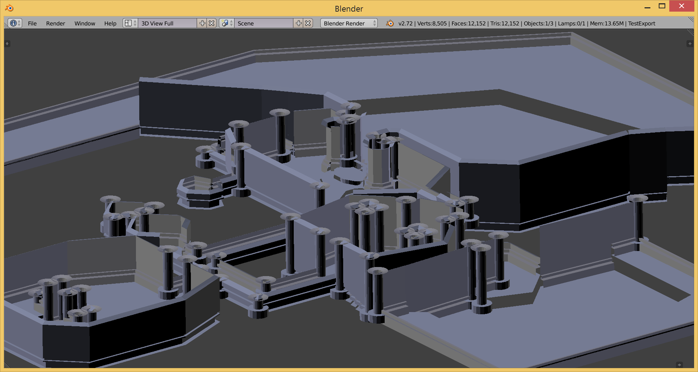
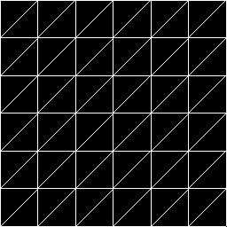
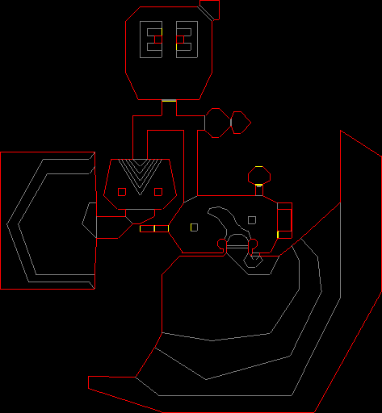
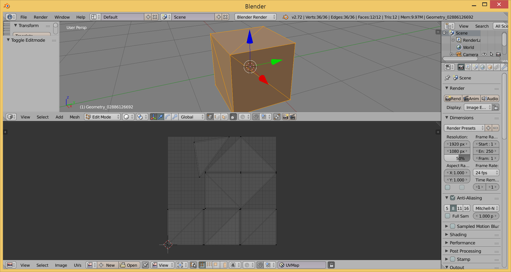

# Urho3D ProcGeom

**NOTE:** Image, IndexBuffer, and Drawable only contain one addition each: DrawLine, SetDataOptimal (*converts 32-bit to 16-bit indices if possible*), and WriteGeometryToOBJ.

Procedural geometry utilities for Urho3D.

- Lathe
  - ParShapes based surface of revolution
- Loft
  - Extrude a 2d profile through a series of oriented points
  - No caps
- Spine Loft 
  - Assumes the natural up axis is Y
  - `anchor to zero` for caps
- Carve CSG
  - Helpers for one-off add / subtract / intersect
  - UDIM-like UV coordinate offsets for texture-array packing
- DirectX UV-Atlas
  - Automatic chartings
- Misc Tools
  - Anchoring a list of points to a range
    - Split 50/50 adjust to floor and ceiling
    - Anchor to ceiling (crown-molding)
    - Anchor to floor (base-boards / floor-trim)
  - Render UV layout to Image
    - Only change in `Image.h` / `Image.cpp`
  - Compile static shadow-geometry
    - Merged and reduced to canonicals only
  - Write list of `Geometry` to OBJ
    - Only change in `Drawable.h` / `Drawable.cpp`
  - `CalculateNormals` like the existing calculate tangents
  - Geometry transform helpers
    - Make vertices unique
    - Convert between different vertex layouts
    - basic transforms
    - UV coordinate offsets/transforms
- UDMF Loading
  - **Requires MathGeoLib**: for Polygon
  - **Requires** forked of [GZDoomBuilder](https://github.com/JSandusky/GZDoom-Builder) to do the exporting
  - Not the actual UDMF format (weird right)
    - Might read actual UDMF someday, some work on a generic lexer in there for it
  - Primary purpose is a source for `guiding` or `reference` data to do other procedural things with
  - A few transformations
    - Align edges (move and rotate to line up)
    - remove sectors
    - center the map
    - flip, translate, and rotate

## Example Output

Here the UDMF data for Doom2 MAP01 has been refined using spine-lofts along the walls and lathe objects on corners exceeding a threshold to insert columns.

Changing the 2d profiles used for either quickly changes the feel of the refined mesh.

## Generating UV Images

Wireframes are useful for figuring out how to layout textures for lofts and lathes.

## Loading UDMF (drawing the overhead)

## UV Generation

DX-UV Atlas for automatic UV charting.

## Dependencies

- Carve
- ParShapes (for lathe)
  - Used for merge colocals in the lathe function
- LibIGL
  - Not strict until Laplacian processes are fully ported over
- Eigen
  - For LibIGL

## Works in progress

- Laplacian deformation
  - Need to port over from MathGeoLib dependent version
- Bone-glow automatic weights
  - Need to port over from MathGeoLib dependent version
- Auto UVs
- CGA-like volume grammar
  - sorting out license issues

